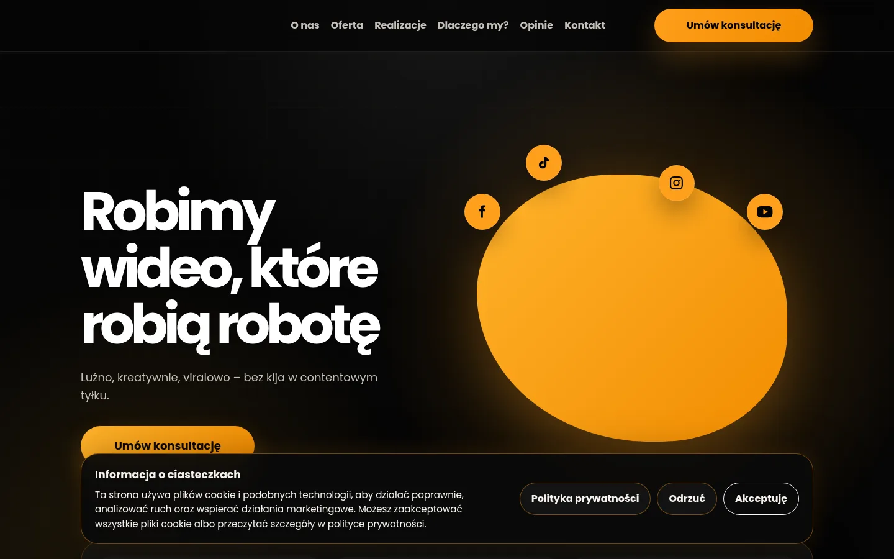
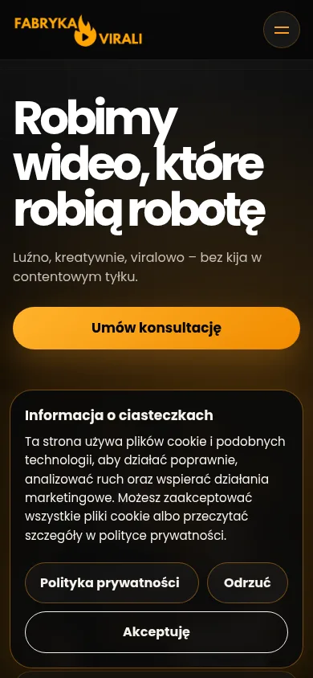

# Fabryka Virali — strona internetowa

Strona firmowa agencji social media, zaprojektowana pod konwersję i szybkie ładowanie — bez frameworków, w czystym HTML/CSS/JS oraz PHP po stronie serwera.

**🔗 Live demo:** [fabrykavirali.pl](https://fabrykavirali.pl)





## O projekcie

Jednostronicowa (one-page) witryna firmowa dla agencji tworzącej treści wideo na TikToka, Instagram i YouTube. Projekt obejmował pełny audyt i przebudowę istniejącej strony: poprawki responsywności (mobile/tablet/desktop), dostępności (WCAG), SEO i wydajności, a także wdrożenie nowych funkcji od zera.

## Kluczowe funkcje

- **W pełni responsywny layout** — od 320 px do desktopu, z osobnym, bardziej zwartym układem „kolażowym" na mobile (mniej przewijania, więcej treści na ekran)
- **Formularz kontaktowy z realną wysyłką e-mail** — własny endpoint w PHP (`send-message.php`) z walidacją po stronie serwera i ochroną antyspamową (honeypot), bez zależności od zewnętrznych usług typu Formspree
- **Natywne wideo zamiast osadzonych ramek TikToka** — filmy z realizacji hostowane samodzielnie (`<video controls>`), skompresowane z surowych nagrań telefonicznych (redukcja rozmiaru nawet o ~95%) — eliminuje to problemy z blokowaniem cookies stron trzecich w przeglądarkach mobilnych
- **Akordeon FAQ** — pytania rozwijane pojedynczo, zbudowany na atrybutach `aria-expanded` bez zależności od JS do samego stylowania
- **Zgodny z RODO baner cookies** — z osobną podstroną polityki prywatności (`/politykaprywatnosci/`) zamiast wyskakującego okienka, oraz odroczonym ładowaniem Google Fonts do momentu wyrażenia zgody
- **Dane strukturalne schema.org** (`LocalBusiness`, `AggregateRating`) pod lepszą widoczność w wynikach wyszukiwania
- **Zoptymalizowane obrazy** — konwersja do WebP, kompresja bez utraty jakości wizualnej (np. 3 MB → ~97 KB dla jednego ze zdjęć)
- **Dostępność** — poprawnie powiązane etykiety formularza (`for`/`id`), wsparcie `prefers-reduced-motion` dla animacji

## Stack technologiczny

| Warstwa | Technologia |
|---|---|
| Struktura | HTML5 (semantyczny) |
| Stylowanie | CSS3 (bez frameworków, mobile-first) |
| Interaktywność | JavaScript (vanilla, bez zależności) |
| Backend formularza | PHP (`mail()`) |
| Hosting | Statyczny hosting współdzielony (cyber_Folks) |

## Struktura projektu

```
├── index.html                 # Główna strona
├── script.js                  # Cała logika JS (menu, formularz, akordeon, slider opinii)
├── send-message.php           # Endpoint formularza kontaktowego
├── css/
│   ├── 01-variables.css       # Zmienne (kolory, cienie)
│   ├── 02-base.css            # Reset i style bazowe
│   ├── 03-layout.css          # Siatki i układ
│   ├── 04-components.css      # Komponenty (przyciski, karty, banery)
│   ├── 05-sections.css        # Style poszczególnych sekcji
│   └── 06-responsive.css      # Media queries
├── assets/
│   ├── img/                   # Zdjęcia (WebP)
│   └── video/                 # Nagrania realizacji (MP4, H.264)
└── politykaprywatnosci/
    └── index.html             # Osobna podstrona polityki prywatności
```

## Uruchomienie lokalnie

Strona nie wymaga procesu budowania — wystarczy serwer HTTP (formularz kontaktowy wymaga PHP, więc `python -m http.server` wystarczy do podglądu wyglądu, ale nie do testowania wysyłki maili):

```bash
php -S localhost:8000
```

i otwórz `http://localhost:8000`.

## Autor

**Jakub Kierat**

---

*Projekt komercyjny wykonany dla klienta — kod udostępniony w celach portfolio.*
